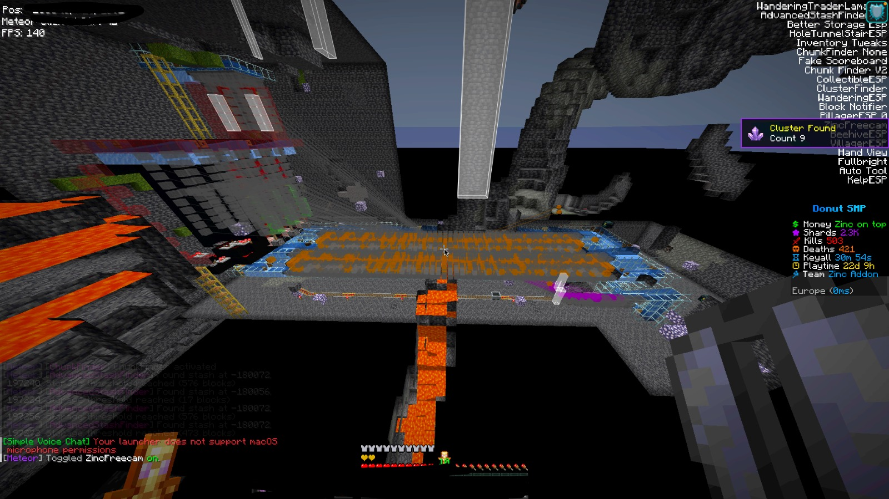
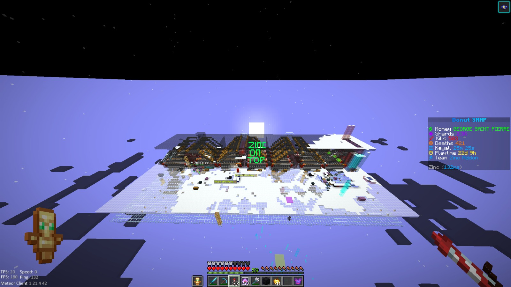
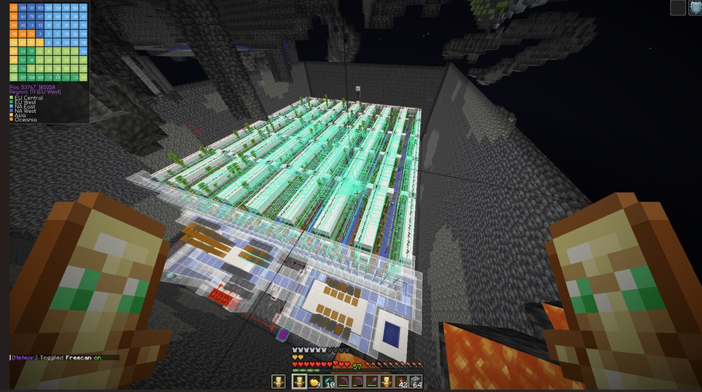
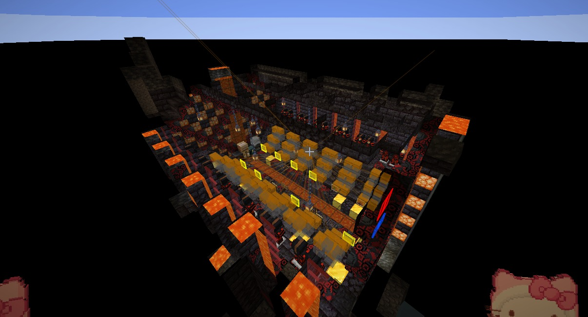
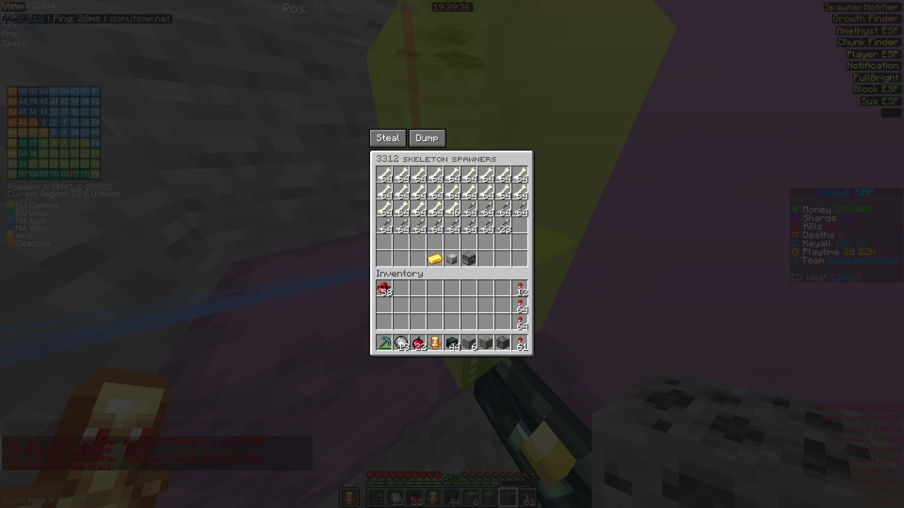
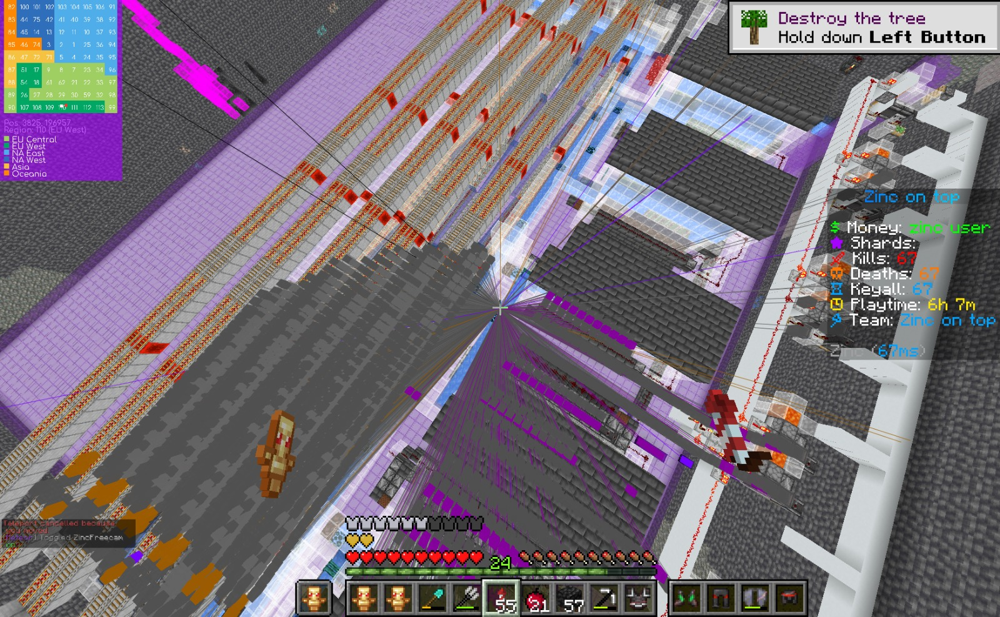

# Zinc Addon

**A Fabric-based addon for Minecraft**

## About

Zinc Addon is a Fabric addon built for **Minecraft 1.21.11**.

## Installation

1. Make sure you are using **Minecraft 1.21.11**.
2. Install a compatible version of **Fabric Loader**.
3. Download the [latest addon file](./zinc-addon-fabric-1.21.11.jar).
4. Move the file into your Minecraft **mods** folder.
5. Launch the game using your Fabric profile.

## Requirements

- Minecraft 1.21.11
- Fabric Loader
- Fabric API (if required)

## Files

| File | Description |
| --- | --- |
| zinc-addon-fabric-1.21.11.jar | Zinc Addon Fabric build |

## License

This project is distributed under the [BSD 3-Clause](./LICENSE) license.

## Modules

Browse the complete categorized module reference in [MODULES.md](./MODULES.md).

## Showcase

Base-hunting and world-analysis screenshots captured with Zinc Addon.

| Base analysis | Infrastructure view |
| --- | --- |
|  |  |

| Farm and storage scan | Underground storage |
| --- | --- |
|  |  |

| Spawner discovery | Chunk and tunnel analysis |
| --- | --- |
|  |  |
